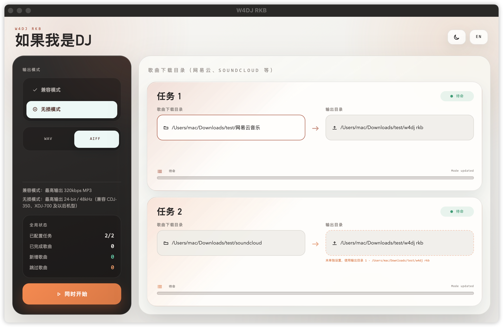

# W4DJ RKB Legacy

如果我是 DJ 🎧



W4DJ RKB Legacy 是 W4DJ RKB 的轻量版本，用于整理和转换 MP3、FLAC、WAV、AIFF 等标准音频文件，让它们更适合导入 Rekordbox，并在 Pioneer CDJ、XDJ 等设备上播放。

> Legacy 版本不包含网易云音乐 `.ncm` 解密功能。请先将音频转换为标准格式，再使用本工具处理。

## 它解决什么问题？

从流媒体平台下载的音乐，常常存在以下问题：

- 采样率过高的音频可能无法被部分 Pioneer 设备识别；
- 转换后歌曲的标题、艺术家、专辑和封面容易丢失；
- 手动逐首处理耗时，输出目录也不易维护。

W4DJ RKB 可以批量扫描下载目录，按任务同步到输出目录，并在处理过程中尽量保留原始元数据和封面。

## 主要功能

### 双任务同步

可以同时配置两个独立任务，每个任务分别设置：

- 歌曲下载目录；
- 输出目录；
- 任务状态和处理进度。

如果任务 2 没有单独设置输出目录，会自动使用任务 1 的输出目录。

### 两种输出模式

| 模式 | 输出特点 | 适用场景 |
| --- | --- | --- |
| 兼容模式 | 最高输出 320kbps MP3 | 文件体积较小，适合通用播放 |
| 无损模式 | 最高 24-bit / 48kHz，可选 WAV 或 AIFF | 适合 Rekordbox 与 Pioneer DJ 设备 |

原文件本身为有损格式时，工具不会虚假提升音质；输出会遵循源文件的实际质量。

### 元数据与封面

处理时会尽量保留或恢复：

- 歌曲名称；
- 艺术家和专辑信息；
- 音频标签；
- 专辑封面。

### 桌面应用界面

- macOS 原生桌面窗口；
- 中文 / 英文界面切换；
- 浅色 / 深色模式切换；
- 可视化任务进度；
- 支持拖放目录；
- Rust 后端负责文件处理和同步。

## 基本使用流程

1. 打开 W4DJ RKB。
2. 为任务 1 和任务 2 选择歌曲下载目录。
3. 选择输出目录；两个任务可以共用一个目录。
4. 选择输出模式：兼容模式或无损模式。
5. 无损模式下选择 WAV 或 AIFF。
6. 点击“同时开始”。
7. 将输出目录导入 Rekordbox，或复制到 DJ 设备使用的存储介质。

## 支持的平台

| 来源 | 支持情况 | 说明 |
| --- | --- | --- |
| MP3 / FLAC / WAV / AIFF | ✅ | 支持标准音频文件处理与采样率转换 |
| SoundCloud | ✅ | 支持下载后的标准音频文件 |

## macOS 安装

从 Releases 下载对应架构的安装包：

- Apple Silicon：`W4DJ RKB Legacy_2.0.1_aarch64.dmg`
- Intel：`W4DJ RKB Legacy_2.0.1_x64.dmg`

首次打开时，如果 macOS 提示应用无法验证：

1. 打开“系统设置 → 隐私与安全性”；
2. 找到被阻止的 W4DJ RKB；
3. 点击“仍要打开”。

也可以在终端中移除隔离属性：

```bash
xattr -cr "/Applications/W4DJ RKB.app"
```

## Windows 安装

从 Releases 下载 Windows 安装包。首次运行时，Windows SmartScreen 可能显示“Windows 已保护你的电脑”。点击“更多信息”，确认应用名称为 **W4DJ RKB Legacy** 后，再点击“仍要运行”。

## 关于“未验证开发者”提示

由于本项目目前没有购买 Apple Developer Program，也没有购买 Windows 代码签名证书，安装包未经过商业开发者签名。因此首次运行时可能出现以下提示：

- macOS：“无法验证开发者”或“应用已损坏”；
- Windows：“Windows 已保护你的电脑”。

这表示系统无法确认发布者身份，不等同于应用文件损坏。请确认安装包来自本项目的 [GitHub Releases](https://github.com/komakizhu/W4DJ-RKB-Legacy/releases)，再按上面的系统说明操作。

如果你不确定文件来源或校验值，请不要继续运行，并重新下载官方 Release 安装包。

## 从源码运行

项目由 Rust、Tauri 和前端应用组成。需要安装 Rust、Node.js、npm 以及 Tauri 的系统依赖。

```bash
cd W4DJ-RKB/app
npm install
npm run build

cd ../src-tauri
cargo tauri dev
```

构建 macOS 安装包：

```bash
cd W4DJ-RKB/src-tauri
cargo tauri build
```

## 项目结构

```text
W4DJ-RKB/
├── app/              # 前端界面
├── src/              # 音频同步与转换逻辑
├── src-tauri/        # Tauri 桌面应用
├── tests/             # Rust 测试
├── config.toml       # 命令行配置
└── imgs/              # 项目图片资源
```

## 免责声明

本项目仅用于个人学习、研究和合法拥有的音频文件处理。请确认你拥有相关音乐文件的合法使用权，并遵守所在地的法律法规以及相关平台的服务条款。

## 致谢

- [Slipstream-Max/w4dj](https://github.com/Slipstream-Max/w4dj) —— 原始同步引擎
